# Apple HealthKit ERD — healthv10 (Home Edition)

**Date: 2026-07-03 03:45 PDT**

**Source of Truth**: `Infrastructure/init/docker-init-home/02-home_schema.sql`
**See also**: `AppleHealthKitDataModel.md` for detailed documentation

---

## Quick Index

| # | Table | Per-User | Purpose |
|---|-------|:---:|---------|
| 1 | `hkit_record_types` | No (global lookup) | HealthKit type identifier lookup (type_identifier → display_name, unit) |
| 2 | `hkit_sources` | Yes | Devices/apps that recorded data |
| 3 | `hkit_records` | Yes | Generic health samples (steps, HR, temp, etc.) — high-volume |
| 4 | `hkit_activity_summaries` | Yes | Daily Apple Watch activity rings |
| 5 | `hkit_workouts` | Yes | Workout sessions with activity type, duration, energy |
| 6 | `hkit_user_profile` | Yes | Characteristics (DOB, sex, blood type); one row per user |
| 7 | `hkit_clinical_records` | Yes | Raw FHIR R4 JSON from connected institutions |
| 8 | `hkit_lab_observations` | Yes | Extracted lab values with LOINC codes |
| 9 | `hkit_medications` | Yes | Extracted medication records from FHIR |
| 10 | `hkit_immunizations` | Yes | Extracted vaccine records from FHIR |
| 11 | `hkit_allergies` | Yes | Extracted allergy records from FHIR |
| 12 | `healthkit_import_jobs` | Yes | Background import job tracking |
| 13 | `hkit_sync_anchors` | Yes | Per-device `HKAnchoredObjectQuery` anchor tokens (incremental-sync cursors) |

Every per-user table carries `tenant_id` (always `1` — the fixed app-level scoping convention) and `user_id`, with a composite `FOREIGN KEY (tenant_id, user_id) REFERENCES users(tenant_id, id) ON DELETE CASCADE`. Per-user privacy is enforced in the application: every query binds `tenant_id = 1 AND user_id = %s` explicitly.

---

## Mermaid ERD — HealthKit Domain

```mermaid
erDiagram
    %% ===== REFERENCE (Global) =====
    hkit_record_types {
        integer id PK "GENERATED ALWAYS"
        text type_identifier UK "HKQuantityTypeIdentifier*"
        text display_name
        text category
        text unit
    }

    %% ===== SOURCES =====
    hkit_sources {
        smallint tenant_id PK "DEFAULT 1"
        integer id PK "GENERATED ALWAYS"
        uuid user_id FK
        text source_name "NOT NULL"
        text source_bundle_id UK "UNIQUE per user"
        text source_version
        text device_name
        text device_model
        timestamptz created_at
    }

    %% ===== HEALTH SAMPLES (high-volume) =====
    hkit_records {
        smallint tenant_id PK "DEFAULT 1"
        bigint id PK "GENERATED ALWAYS"
        uuid user_id FK
        integer record_type_id FK "-> hkit_record_types"
        integer source_id "-> hkit_sources (by convention)"
        numeric value
        text unit
        timestamptz start_date
        timestamptz end_date
        jsonb metadata
        timestamptz created_at
    }

    %% ===== ACTIVITY RINGS =====
    hkit_activity_summaries {
        smallint tenant_id PK "DEFAULT 1"
        bigint id PK "GENERATED ALWAYS"
        uuid user_id FK
        date date UK "One per user per day"
        numeric active_energy_burned
        numeric active_energy_burned_goal
        integer exercise_time
        integer exercise_time_goal
        integer stand_hours
        integer stand_hours_goal
        integer move_time "Move Time ring variant"
        integer move_time_goal
        timestamptz created_at
    }

    %% ===== WORKOUTS =====
    hkit_workouts {
        smallint tenant_id PK "DEFAULT 1"
        bigint id PK "GENERATED ALWAYS"
        uuid user_id FK
        text workout_type "NOT NULL, HKWorkoutActivityType"
        integer source_id "-> hkit_sources (by convention)"
        timestamptz start_date
        timestamptz end_date
        numeric duration_seconds
        numeric total_distance
        numeric total_energy_burned
        jsonb metadata
        timestamptz created_at
    }

    %% ===== USER PROFILE (one-to-one) =====
    hkit_user_profile {
        smallint tenant_id PK "DEFAULT 1"
        integer id PK "GENERATED ALWAYS"
        uuid user_id FK "UNIQUE - one per user"
        date date_of_birth
        text biological_sex
        text blood_type
        text fitzpatrick_skin_type
        boolean wheelchair_use
        timestamptz updated_at
    }

    %% ===== CLINICAL RECORDS (FHIR R4) =====
    hkit_clinical_records {
        smallint tenant_id PK "DEFAULT 1"
        integer id PK "GENERATED ALWAYS"
        uuid user_id FK
        text fhir_resource_type "NOT NULL"
        text fhir_identifier UK "Partial unique per user"
        text fhir_source_url
        text display_name
        timestamptz received_date
        jsonb raw_fhir "Full FHIR R4 JSON"
        timestamptz created_at
    }

    %% ===== LAB OBSERVATIONS (extracted from FHIR) =====
    hkit_lab_observations {
        smallint tenant_id PK "DEFAULT 1"
        integer id PK "GENERATED ALWAYS"
        uuid user_id FK
        integer clinical_record_id FK "-> hkit_clinical_records"
        text loinc_code
        text display_name
        numeric value_quantity
        text value_unit
        text value_string
        text reference_range
        text interpretation
        timestamptz effective_date
        timestamptz created_at
    }

    %% ===== MEDICATIONS (extracted from FHIR) =====
    hkit_medications {
        smallint tenant_id PK "DEFAULT 1"
        integer id PK "GENERATED ALWAYS"
        uuid user_id FK
        integer clinical_record_id FK "-> hkit_clinical_records"
        text medication_code
        text medication_name "NOT NULL"
        text dosage
        text status
        timestamptz authored_date
        timestamptz created_at
    }

    %% ===== IMMUNIZATIONS (extracted from FHIR) =====
    hkit_immunizations {
        smallint tenant_id PK "DEFAULT 1"
        integer id PK "GENERATED ALWAYS"
        uuid user_id FK
        integer clinical_record_id FK "-> hkit_clinical_records"
        text vaccine_code
        text vaccine_name "NOT NULL"
        timestamptz administered_date
        text lot_number
        timestamptz created_at
    }

    %% ===== ALLERGIES (extracted from FHIR) =====
    hkit_allergies {
        smallint tenant_id PK "DEFAULT 1"
        integer id PK "GENERATED ALWAYS"
        uuid user_id FK
        integer clinical_record_id FK "-> hkit_clinical_records"
        text allergen "NOT NULL"
        text reaction
        text severity
        timestamptz onset_date
        timestamptz created_at
    }

    %% ===== IMPORT JOBS =====
    healthkit_import_jobs {
        smallint tenant_id PK "DEFAULT 1"
        uuid id PK "gen_random_uuid"
        uuid user_id FK
        text status "pending|processing|completed|failed"
        integer total_records
        integer processed_records "DEFAULT 0"
        text error_message
        timestamptz started_at
        timestamptz completed_at
        timestamptz created_at
    }

    %% ===== SYNC ANCHORS (per-device HKAnchoredObjectQuery state) =====
    hkit_sync_anchors {
        smallint tenant_id PK "DEFAULT 1"
        uuid user_id PK "FK -> users"
        text device_id PK "Stable per-install identifier"
        text sample_type PK "HK type identifier"
        text anchor "NOT NULL, opaque HKQueryAnchor token"
        timestamptz updated_at "NOT NULL"
    }

    %% ===== RELATIONSHIPS =====

    %% Users -> HealthKit tables (users table defined in the main ERD)
    users ||--o{ hkit_sources : "owns"
    users ||--|| hkit_user_profile : "has"
    users ||--o{ hkit_records : "records"
    users ||--o{ hkit_workouts : "logs"
    users ||--o{ hkit_activity_summaries : "tracks"
    users ||--o{ hkit_clinical_records : "imports"
    users ||--o{ hkit_lab_observations : "owns"
    users ||--o{ hkit_medications : "owns"
    users ||--o{ hkit_immunizations : "owns"
    users ||--o{ hkit_allergies : "owns"
    users ||--o{ healthkit_import_jobs : "triggers"
    users ||--o{ hkit_sync_anchors : "resumes"

    %% Record type and source lookups
    hkit_record_types ||--o{ hkit_records : "classifies"
    hkit_sources ||--o{ hkit_records : "produced"
    hkit_sources ||--o{ hkit_workouts : "produced"

    %% Clinical record -> extracted children (one extracted row per parent)
    hkit_clinical_records ||--o| hkit_lab_observations : "extracts to"
    hkit_clinical_records ||--o| hkit_medications : "extracts to"
    hkit_clinical_records ||--o| hkit_immunizations : "extracts to"
    hkit_clinical_records ||--o| hkit_allergies : "extracts to"
```



Notes on the diagram:

- `record_type_id` is a declared FK to `hkit_record_types(id)`. The `source_id` and `clinical_record_id` columns reference their parents' `id` by convention, maintained by the ingest code — the parents' composite `(tenant_id, id)` primary keys make a simple column FK impractical.
- The clinical-record → extract-table relationships are one-to-at-most-one (`||--o|`): each parent contributes at most one extracted row, enforced by the partial unique indexes below.

---

## Index Inventory

| Index | Table | Type | Columns | Purpose |
|-------|-------|------|---------|---------|
| `idx_hkit_records_tenant_user_type` | `hkit_records` | btree | `(tenant_id, user_id, record_type_id, start_date DESC)` | Query by type within date range |
| `idx_hkit_records_dedup` | `hkit_records` | unique btree | `(tenant_id, user_id, record_type_id, source_id, start_date, end_date)` | Prevent duplicate sample import |
| `idx_hkit_workouts_tenant_user_date` | `hkit_workouts` | btree | `(tenant_id, user_id, start_date DESC)` | Query workouts by date |
| `idx_hkit_clinical_tenant_user` | `hkit_clinical_records` | btree | `(tenant_id, user_id)` | Query clinical records by user |
| `ux_hkit_clinical_records_fhir_id` | `hkit_clinical_records` | partial unique | `(tenant_id, user_id, fhir_identifier) WHERE fhir_identifier IS NOT NULL` | Re-import of the same FHIR resource is a no-op |
| `idx_hkit_labs_tenant_user` | `hkit_lab_observations` | btree | `(tenant_id, user_id)` | Query lab results by user |
| `ux_hkit_lab_observations_parent` | `hkit_lab_observations` | partial unique | `(tenant_id, user_id, clinical_record_id) WHERE clinical_record_id IS NOT NULL` | One extracted lab row per parent clinical record |
| `ux_hkit_medications_parent` | `hkit_medications` | partial unique | `(tenant_id, user_id, clinical_record_id) WHERE clinical_record_id IS NOT NULL` | One extracted medication row per parent |
| `ux_hkit_immunizations_parent` | `hkit_immunizations` | partial unique | `(tenant_id, user_id, clinical_record_id) WHERE clinical_record_id IS NOT NULL` | One extracted immunization row per parent |
| `ux_hkit_allergies_parent` | `hkit_allergies` | partial unique | `(tenant_id, user_id, clinical_record_id) WHERE clinical_record_id IS NOT NULL` | One extracted allergy row per parent |

**Unique constraints** (declared on the table):

- `hkit_record_types`: unique on `(type_identifier)` — global dedup
- `hkit_sources`: unique on `(tenant_id, user_id, source_bundle_id)` — one source entry per app per user
- `hkit_activity_summaries`: unique on `(tenant_id, user_id, date)` — one summary per day per user
- `hkit_user_profile`: unique on `(tenant_id, user_id)` — one profile per user
- `hkit_sync_anchors`: composite PK on `(tenant_id, user_id, device_id, sample_type)` — one anchor per device per sample type

---

## Data Flow

```
                    HealthKit (iOS)
                          |
          ┌───────────────┴───────────────┐
          |                               |
   live sync                        export ZIP upload
   POST /api/v1/healthkit/sync      POST /api/v1/healthkit/upload
          |                               |
          |                    ┌──────────────────────┐
          |                    │ healthkit_import_jobs │  (pending -> processing
          |                    └──────────┬───────────┘   -> completed | failed)
          |                               |  in-process daemon thread
          └───────────────┬───────────────┘
                          v
    ┌─────────────┬──────────────┬────────────────┬─────────────────────┐
    v             v              v                v                     v
 hkit_records  hkit_workouts  hkit_activity   hkit_user_profile  hkit_clinical_records
 (samples)     (sessions)     _summaries      (characteristics)   (FHIR R4 JSON)
    |                         (daily rings)                             |
    v                                              ┌──────────┬─────────┼──────────┐
 hkit_record_types                                 v          v         v          v
 hkit_sources                                 hkit_lab_   hkit_     hkit_      hkit_
 (lookups)                                    observations medications immunizations allergies
```

Live sync additionally UPSERTs the client's anchor map into `hkit_sync_anchors` and projects weight and blood pressure into the derived `health_metrics` / `health_blood_pressure_readings` tables (source data lands in `hkit_*` first; `health_*` is derived).

All timestamps stored in UTC (`TIMESTAMPTZ`). Localized to the user's `home_timezone` for display.
