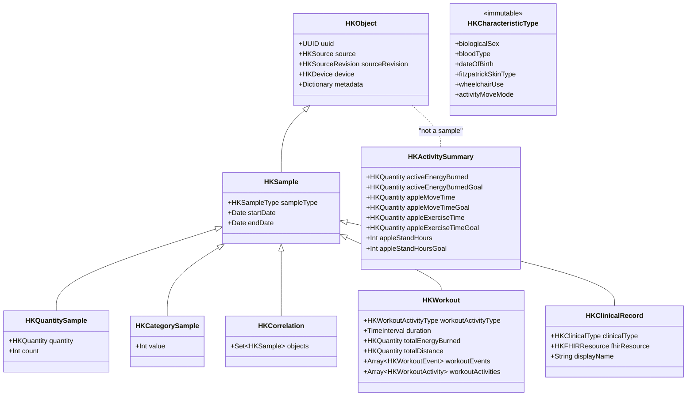

# HealthKit Data Model — Complete Apple HealthKit Taxonomy & Minowa Mapping

**Generated**: 2026-03-20 12:00 PT
**Source**: Apple HealthKit Framework (iOS 8–18, watchOS 2–11) + Minowa.ai mobile bridge + healthv10 backend
**Stage**: Alpha
**App Name**: Minowa.ai
**Manual Review**: Pending

---

## Executive Summary

This document is the authoritative reference for **everything Apple's HealthKit framework can produce** and how Minowa.ai consumes it. It covers all six HealthKit object families (Quantity, Category, Characteristic, Correlation, Workout, Clinical), the full type identifier taxonomy for each, and maps every type to:

1. **Native bridge** — what the React Native `HealthKitAdapter` reads (`react-native-health-module/`)
2. **Sync layer** — how `HealthSyncManager` normalizes and ships data to the backend
3. **Backend storage** — which `hkit_*` or `health_*` table in `healthv10` receives the data

Types the app **does not yet use** are included and flagged, so this document doubles as a coverage gap analysis.

---

## Architecture Overview

```
┌─────────────────────────────────────────────────────────────────────────────┐
│                        Apple HealthKit Store (on-device)                     │
│                                                                              │
│  ┌─────────────┐ ┌──────────────┐ ┌──────────────┐ ┌────────────────────┐ │
│  │  Quantity    │ │  Category    │ │ Correlation  │ │    Workout         │ │
│  │  Samples     │ │  Samples     │ │  Samples     │ │    Samples         │ │
│  └──────┬──────┘ └──────┬───────┘ └──────┬───────┘ └────────┬───────────┘ │
│         │               │                │                   │              │
│  ┌──────┴──────┐ ┌──────┴───────┐ ┌──────┴────────────┐    │              │
│  │ Character-  │ │  Clinical    │ │  Activity          │    │              │
│  │ istics      │ │  Records     │ │  Summaries         │    │              │
│  │ (immutable) │ │  (FHIR R4)   │ │  (Apple Watch)     │    │              │
│  └─────────────┘ └──────────────┘ └────────────────────┘    │              │
└──────────────────────────────────────────────────────────────┼──────────────┘
                                                               │
                         HKHealthStore.execute(query)          │
                                    │                          │
                                    ▼                          ▼
┌─────────────────────────────────────────────────────────────────────────────┐
│                    HealthKitAdapter.mm (iOS native bridge)                   │
│                                                                              │
│  queryQuantitySamples()  queryCategorySamples()  queryWorkouts()            │
│  queryCorrelationSamples()  queryClinicalRecords()  queryActivitySummary()  │
│  readCharacteristics()                                                       │
└──────────────────────────────┬──────────────────────────────────────────────┘
                               │ React Native TurboModule
                               ▼
┌─────────────────────────────────────────────────────────────────────────────┐
│           HealthBridge.ts → HealthSyncManager.ts → API client               │
│                                                                              │
│  HealthDataType (camelCase)  →  HealthDataType (snake_case)  →  POST /sync │
│  e.g. "heartRate"            →  "heart_rate"                  →  API payload │
└──────────────────────────────┬──────────────────────────────────────────────┘
                               │
                               ▼
┌─────────────────────────────────────────────────────────────────────────────┐
│                         healthv10 (PostgreSQL + pgvector)                    │
│                                                                              │
│  hkit_records          (generic quantity/category samples)                   │
│  hkit_record_types     (lookup: type_identifier → display_name, unit)       │
│  hkit_sources          (devices/apps per user)                              │
│  hkit_user_profile     (characteristics: DOB, sex, blood type)              │
│  hkit_workouts         (workout sessions)                                   │
│  hkit_activity_summaries (daily Apple Watch rings)                          │
│  hkit_clinical_records (raw FHIR JSON)                                      │
│  hkit_lab_observations (parsed lab values with LOINC codes)                 │
│  hkit_medications      (parsed medication records)                          │
│  hkit_immunizations    (parsed vaccine records)                             │
│  hkit_allergies        (parsed allergy records)                             │
│  healthkit_import_jobs (import job tracking)                                │
└─────────────────────────────────────────────────────────────────────────────┘
```

---

## 1. HealthKit Object Hierarchy

All HealthKit data descends from `HKObject`, which carries metadata common to every sample.



### 1.1 Common Fields on Every HKObject

| Field | Type | Description | Backend Column |
|-------|------|-------------|----------------|
| `uuid` | UUID | Unique per-sample identifier assigned by HealthKit | `hkit_records.id` (mapped) |
| `sourceRevision.source.name` | String | App or device name (e.g. "Apple Watch", "MyFitnessPal") | `hkit_sources.source_name` |
| `sourceRevision.source.bundleIdentifier` | String | Bundle ID (e.g. "com.apple.health") | `hkit_sources.source_bundle_id` |
| `sourceRevision.version` | String | App version | `hkit_sources.source_version` |
| `device.name` | String | Hardware name | `hkit_sources.device_name` |
| `device.model` | String | Hardware model | `hkit_sources.device_model` |
| `device.manufacturer` | String | e.g. "Apple Inc." | — (not stored) |
| `device.hardwareVersion` | String | e.g. "Watch6,1" | — (not stored) |
| `device.softwareVersion` | String | e.g. "10.2" | — (not stored) |
| `metadata` | [String: Any] | Key-value pairs (see §8 Metadata Keys) | `hkit_records.metadata` (JSONB) |

### 1.2 Common Fields on Every HKSample

| Field | Type | Description | Backend Column |
|-------|------|-------------|----------------|
| `sampleType` | HKSampleType | The type identifier | `hkit_records.record_type_id` → `hkit_record_types` |
| `startDate` | Date | Sample start timestamp | `hkit_records.start_date` |
| `endDate` | Date | Sample end timestamp | `hkit_records.end_date` |

---

## 2. Quantity Types (HKQuantityTypeIdentifier)

Quantity samples carry a numeric `HKQuantity` with an associated `HKUnit`. This is the largest family in HealthKit.

### 2.1 Body Measurements

| Identifier | Unit | iOS | Bridge Key | Sync Type | Backend |
|-----------|------|-----|------------|-----------|---------|
| `bodyMassIndex` | count | 8.0 | — | — | hkit_records |
| `bodyFatPercentage` | % (0–1) | 8.0 | `bodyFatPercentage` | `body_fat_percentage` | hkit_records |
| `height` | m | 8.0 | `height` | `height` | hkit_records |
| `bodyMass` | kg | 8.0 | `weight` | `weight` | hkit_records, health_metrics |
| `leanBodyMass` | kg | 8.0 | `leanBodyMass` | `lean_body_mass` | hkit_records |
| `waistCircumference` | m | 11.0 | — | — | — |
| `appleSleepingWristTemperature` | degC | 16.0 | — | — | — |

### 2.2 Fitness & Activity

| Identifier | Unit | iOS | Bridge Key | Sync Type | Backend |
|-----------|------|-----|------------|-----------|---------|
| `stepCount` | count | 8.0 | `steps` | `steps` | hkit_records |
| `distanceWalkingRunning` | m | 8.0 | `distanceWalkingRunning` | `distance_walking_running` | hkit_records |
| `distanceCycling` | m | 8.0 | — | — | — |
| `distanceWheelchair` | m | 10.0 | — | — | — |
| `distanceSwimming` | m | 10.0 | — | — | — |
| `distanceDownhillSnowSports` | m | 11.0 | — | — | — |
| `basalEnergyBurned` | kcal | 8.0 | `basalEnergyBurned` | `basal_energy_burned` | hkit_records |
| `activeEnergyBurned` | kcal | 8.0 | `activeEnergyBurned` | `active_energy_burned` | hkit_records |
| `flightsClimbed` | count | 8.0 | `floorsClimbed` | `floors_climbed` | hkit_records |
| `nikeFuel` | count | 8.0 | — | — | — |
| `appleExerciseTime` | min | 9.3 | — | — | — |
| `pushCount` | count | 10.0 | `wheelchairPushes` | `wheelchair_pushes` | hkit_records |
| `swimmingStrokeCount` | count | 10.0 | — | — | — |
| `vo2Max` | mL/kg·min | 11.0 | `vo2Max` | `vo2_max` | hkit_records |
| `appleMoveTime` | min | 14.5 | — | — | — |
| `appleStandTime` | min | 13.0 | — | — | — |
| `appleWalkingSteadiness` | % (0–1) | 15.0 | — | — | — |
| `runningStrideLength` | m | 16.0 | — | — | — |
| `runningVerticalOscillation` | m | 16.0 | — | — | — |
| `runningGroundContactTime` | ms | 16.0 | — | — | — |
| `runningPower` | W | 16.0 | — | — | — |
| `runningSpeed` | m/s | 16.0 | — | — | — |
| `physicalEffort` | kcal/hr·kg | 17.0 | — | — | — |
| `cyclingSpeed` | m/s | 17.0 | — | — | — |
| `cyclingPower` | W | 17.0 | — | — | — |
| `cyclingFunctionalThresholdPower` | W | 17.0 | — | — | — |
| `cyclingCadence` | count/min | 17.0 | — | — | — |
| `workoutEffortScore` | scalar (0–10) | 18.0 | — | — | — |
| `crossCountrySkiingSpeed` | m/s | 18.0 | — | — | — |
| `distanceCrossCountrySkiing` | m | 18.0 | — | — | — |
| `paddleSportsSpeed` | m/s | 18.0 | — | — | — |
| `rowingSpeed` | m/s | 18.0 | — | — | — |

### 2.3 Vitals

| Identifier | Unit | iOS | Bridge Key | Sync Type | Backend |
|-----------|------|-----|------------|-----------|---------|
| `heartRate` | count/min | 8.0 | `heartRate` | `heart_rate` | hkit_records |
| `restingHeartRate` | count/min | 11.0 | `restingHeartRate` | `resting_heart_rate` | hkit_records |
| `walkingHeartRateAverage` | count/min | 11.0 | — | — | — |
| `heartRateVariabilitySDNN` | ms | 11.0 | `heartRateVariabilitySDNN` | `heart_rate_variability` | hkit_records |
| `heartRateRecoveryOneMinute` | count/min | 16.0 | — | — | — |
| `oxygenSaturation` | % (0–1) | 8.0 | `oxygenSaturation` | `oxygen_saturation` | hkit_records |
| `bodyTemperature` | degC | 8.0 | `bodyTemperature` | `body_temperature` | hkit_records |
| `basalBodyTemperature` | degC | 9.0 | `basalBodyTemperature` | `basal_body_temperature` | hkit_records |
| `bloodPressureSystolic` | mmHg | 8.0 | (via correlation) | `blood_pressure` | hkit_records |
| `bloodPressureDiastolic` | mmHg | 8.0 | (via correlation) | `blood_pressure` | hkit_records |
| `respiratoryRate` | count/min | 8.0 | `respiratoryRate` | `respiratory_rate` | hkit_records |
| `peripheralPerfusionIndex` | % (0–1) | 8.0 | — | — | — |

### 2.4 Lab & Metabolic

| Identifier | Unit | iOS | Bridge Key | Sync Type | Backend |
|-----------|------|-----|------------|-----------|---------|
| `bloodGlucose` | mg/dL | 8.0 | `bloodGlucose` | `blood_glucose` | hkit_records |
| `electrodermalActivity` | µS | 8.0 | — | — | — |
| `forcedExpiratoryVolume1` | L | 8.0 | — | — | — |
| `forcedVitalCapacity` | L | 8.0 | — | — | — |
| `inhalerUsage` | count | 8.0 | — | — | — |
| `insulinDelivery` | IU | 11.0 | — | — | — |
| `peakExpiratoryFlowRate` | L/min | 8.0 | — | — | — |
| `numberOfTimesFallen` | count | 8.0 | — | — | — |
| `bloodAlcoholContent` | % (0–1) | 8.0 | — | — | — |
| `numberOfAlcoholicBeverages` | count | 15.0 | — | — | — |

### 2.5 Nutrition (Dietary)

| Identifier | Unit | iOS | Bridge Key | Sync Type | Backend |
|-----------|------|-----|------------|-----------|---------|
| `dietaryEnergyConsumed` | kcal | 8.0 | `dietaryEnergyConsumed` | `nutrition` | hkit_records |
| `dietaryFatTotal` | g | 8.0 | — | — | — |
| `dietaryFatSaturated` | g | 8.0 | — | — | — |
| `dietaryFatMonounsaturated` | g | 8.0 | — | — | — |
| `dietaryFatPolyunsaturated` | g | 8.0 | — | — | — |
| `dietaryCholesterol` | mg | 8.0 | — | — | — |
| `dietarySodium` | mg | 8.0 | — | — | — |
| `dietaryCarbohydrates` | g | 8.0 | — | — | — |
| `dietaryFiber` | g | 8.0 | — | — | — |
| `dietarySugar` | g | 8.0 | — | — | — |
| `dietaryProtein` | g | 8.0 | — | — | — |
| `dietaryCalcium` | mg | 8.0 | — | — | — |
| `dietaryIron` | mg | 8.0 | — | — | — |
| `dietaryPotassium` | mg | 8.0 | — | — | — |
| `dietaryVitaminA` | µg | 8.0 | — | — | — |
| `dietaryVitaminB6` | mg | 8.0 | — | — | — |
| `dietaryVitaminB12` | µg | 8.0 | — | — | — |
| `dietaryVitaminC` | mg | 8.0 | — | — | — |
| `dietaryVitaminD` | µg | 8.0 | — | — | — |
| `dietaryVitaminE` | mg | 8.0 | — | — | — |
| `dietaryVitaminK` | µg | 8.0 | — | — | — |
| `dietaryBiotin` | µg | 8.0 | — | — | — |
| `dietaryCaffeine` | mg | 8.0 | — | — | — |
| `dietaryChromium` | µg | 8.0 | — | — | — |
| `dietaryCopper` | mg | 8.0 | — | — | — |
| `dietaryFolate` | µg | 8.0 | — | — | — |
| `dietaryIodine` | µg | 8.0 | — | — | — |
| `dietaryMagnesium` | mg | 8.0 | — | — | — |
| `dietaryManganese` | mg | 8.0 | — | — | — |
| `dietaryMolybdenum` | µg | 8.0 | — | — | — |
| `dietaryNiacin` | mg | 8.0 | — | — | — |
| `dietaryPantothenicAcid` | mg | 8.0 | — | — | — |
| `dietaryPhosphorus` | mg | 8.0 | — | — | — |
| `dietaryRiboflavin` | mg | 8.0 | — | — | — |
| `dietarySelenium` | µg | 8.0 | — | — | — |
| `dietaryThiamin` | mg | 8.0 | — | — | — |
| `dietaryZinc` | mg | 8.0 | — | — | — |
| `dietaryWater` | mL | 8.0 | `dietaryWater` | `hydration` | hkit_records |

### 2.6 Reproductive Health

| Identifier | Unit | iOS | Bridge Key | Sync Type | Backend |
|-----------|------|-----|------------|-----------|---------|
| _(none — reproductive data uses Category types, see §3.3)_ | | | | | |

### 2.7 UV & Environment

| Identifier | Unit | iOS | Bridge Key | Sync Type | Backend |
|-----------|------|-----|------------|-----------|---------|
| `uvExposure` | count | 9.0 | — | — | — |
| `waterTemperature` | degC | 16.0 | — | — | — |
| `underwaterDepth` | m | 16.0 | — | — | — |

### 2.8 Hearing

| Identifier | Unit | iOS | Bridge Key | Sync Type | Backend |
|-----------|------|-----|------------|-----------|---------|
| `environmentalAudioExposure` | dBASPL | 13.0 | — | — | — |
| `headphoneAudioExposure` | dBASPL | 13.0 | — | — | — |
| `environmentalSoundReduction` | dBASPL | 16.0 | — | — | — |

---

## 3. Category Types (HKCategoryTypeIdentifier)

Category samples carry an integer `value` that maps to a type-specific enum. Unlike quantity types, the value is not a free-form number — it is one of a fixed set.

### 3.1 Sleep

| Identifier | Values | iOS | Bridge Key | Sync Type | Backend |
|-----------|--------|-----|------------|-----------|---------|
| `sleepAnalysis` | `inBed=0`, `asleepUnspecified=1`, `awake=2`, `asleepCore=3`, `asleepDeep=4`, `asleepREM=5` | 8.0 (stages: 16.0) | `sleep` | `sleep` | hkit_records |

**Note**: iOS 16+ introduced granular sleep stages. Prior versions only had `inBed`/`asleep`/`awake`.

### 3.2 Activity & Mindfulness

| Identifier | Values | iOS | Bridge Key | Sync Type | Backend |
|-----------|--------|-----|------------|-----------|---------|
| `appleStandHour` | `idle=0`, `stood=1` | 9.0 | — | — | — |
| `mindfulSession` | (no value; presence = session occurred) | 10.0 | — | — | — |
| `handwashingEvent` | (no value) | 14.0 | — | — | — |
| `toothbrushingEvent` | (no value) | 13.0 | — | — | — |

### 3.3 Reproductive Health

| Identifier | Values | iOS | Bridge Key | Sync Type | Backend |
|-----------|--------|-----|------------|-----------|---------|
| `menstrualFlow` | `unspecified=1`, `light=2`, `medium=3`, `heavy=4`, `none=5` | 9.0 | — | — | — |
| `intermenstrualBleeding` | (no value) | 9.0 | — | — | — |
| `ovulationTestResult` | `negative=1`, `luteinizingSurge=2`, `indeterminate=3`, `estrogenSurge=4` | 9.0 | — | — | — |
| `cervicalMucusQuality` | `dry=1`, `sticky=2`, `creamy=3`, `watery=4`, `eggWhite=5` | 9.0 | — | — | — |
| `sexualActivity` | `notApplicable=0`, unprotected/protected via metadata | 9.0 | — | — | — |
| `pregnancyTestResult` | `negative=1`, `positive=2`, `indeterminate=3` | 15.0 | — | — | — |
| `progesteroneTestResult` | `negative=1`, `positive=2`, `indeterminate=3` | 15.0 | — | — | — |
| `contraceptive` | `unspecified=1`, `implant=2`, `injection=3`, `iud=4`, `intravaginalRing=5`, `oral=6`, `patch=7` | 16.0 | — | — | — |
| `lactation` | (no value) | 16.0 | — | — | — |
| `infrequentMenstrualCycles` | (no value) | 16.0 | — | — | — |
| `irregularMenstrualCycles` | (no value) | 16.0 | — | — | — |
| `persistentIntermenstrualBleeding` | (no value) | 16.0 | — | — | — |
| `prolongedMenstrualPeriods` | (no value) | 16.0 | — | — | — |

### 3.4 Symptoms

| Identifier | Values | iOS | Bridge Key | Sync Type | Backend |
|-----------|--------|-----|------------|-----------|---------|
| `abdominalCramps` | `notPresent=1`, `mild=2`, `moderate=3`, `severe=4` | 13.4 | — | — | — |
| `acne` | same severity scale | 13.4 | — | — | — |
| `appetiteChanges` | `noChange=1`, `decreased=2`, `increased=3` | 13.4 | — | — | — |
| `bladderIncontinence` | severity scale | 14.0 | — | — | — |
| `bloating` | severity scale | 13.4 | — | — | — |
| `breastPain` | severity scale | 13.4 | — | — | — |
| `chestTightnessOrPain` | severity scale | 13.4 | — | — | — |
| `chills` | severity scale | 13.4 | — | — | — |
| `constipation` | severity scale | 13.4 | — | — | — |
| `coughing` | severity scale | 13.4 | — | — | — |
| `diarrhea` | severity scale | 13.4 | — | — | — |
| `dizziness` | severity scale | 13.4 | — | — | — |
| `drySkin` | severity scale | 14.0 | — | — | — |
| `fainting` | severity scale | 13.4 | — | — | — |
| `fatigue` | severity scale | 13.4 | — | — | — |
| `fever` | severity scale | 13.4 | — | — | — |
| `generalizedBodyAche` | severity scale | 13.4 | — | — | — |
| `hairLoss` | severity scale | 14.0 | — | — | — |
| `headache` | severity scale | 13.4 | — | — | — |
| `heartburn` | severity scale | 13.4 | — | — | — |
| `hotFlashes` | severity scale | 13.4 | — | — | — |
| `lossOfSmell` | severity scale | 13.4 | — | — | — |
| `lossOfTaste` | severity scale | 13.4 | — | — | — |
| `lowerBackPain` | severity scale | 13.4 | — | — | — |
| `memoryLapse` | severity scale | 14.0 | — | — | — |
| `moodChanges` | `notPresent=1`, `present=2` | 13.4 | — | — | — |
| `nausea` | severity scale | 13.4 | — | — | — |
| `nightSweats` | severity scale | 14.0 | — | — | — |
| `pelvicPain` | severity scale | 13.4 | — | — | — |
| `rapidPoundingOrFlutteringHeartbeat` | severity scale | 13.4 | — | — | — |
| `runnyNose` | severity scale | 13.4 | — | — | — |
| `shortnessOfBreath` | severity scale | 13.4 | — | — | — |
| `sinusCongestion` | severity scale | 13.4 | — | — | — |
| `skippedHeartbeat` | severity scale | 13.4 | — | — | — |
| `sleepChanges` | `notPresent=1`, `present=2` | 13.4 | — | — | — |
| `soreThroat` | severity scale | 13.4 | — | — | — |
| `vaginalDryness` | severity scale | 14.0 | — | — | — |
| `vomiting` | severity scale | 13.4 | — | — | — |
| `wheezing` | severity scale | 13.4 | — | — | — |

### 3.5 Cardiovascular Events

| Identifier | Values | iOS | Bridge Key | Sync Type | Backend |
|-----------|--------|-----|------------|-----------|---------|
| `highHeartRateEvent` | (no value) | 12.2 | — | — | — |
| `lowHeartRateEvent` | (no value) | 12.2 | — | — | — |
| `irregularHeartRhythmEvent` | (no value) | 12.2 | — | — | — |

### 3.6 Mobility

| Identifier | Values | iOS | Bridge Key | Sync Type | Backend |
|-----------|--------|-----|------------|-----------|---------|
| `appleWalkingSteadinessEvent` | `initialLow`, `initialVeryLow`, `repeatLow`, `repeatVeryLow` | 15.0 | — | — | — |

### 3.7 Hearing

| Identifier | Values | iOS | Bridge Key | Sync Type | Backend |
|-----------|--------|-----|------------|-----------|---------|
| `environmentalAudioExposureEvent` | (no value; triggered when threshold exceeded) | 14.0 | — | — | — |
| `headphoneAudioExposureEvent` | (no value) | 14.2 | — | — | — |

---

## 4. Characteristic Types (HKCharacteristicTypeIdentifier)

Characteristics are **read-only, user-set values** stored in the Health app. They cannot be written by third-party apps.

| Identifier | Type | Values | iOS | Backend |
|-----------|------|--------|-----|---------|
| `biologicalSex` | `HKBiologicalSex` | `.notSet`, `.female`, `.male`, `.other` | 8.0 | `hkit_user_profile.biological_sex` |
| `bloodType` | `HKBloodType` | `.notSet`, `.aPositive`, `.aNegative`, `.bPositive`, `.bNegative`, `.abPositive`, `.abNegative`, `.oPositive`, `.oNegative` | 8.0 | `hkit_user_profile.blood_type` |
| `dateOfBirth` | `DateComponents` | Full date | 8.0 | `hkit_user_profile.date_of_birth` |
| `fitzpatrickSkinType` | `HKFitzpatrickSkinType` | `.notSet`, `.I` through `.VI` | 9.0 | `hkit_user_profile.fitzpatrick_skin_type` |
| `wheelchairUse` | `HKWheelchairUse` | `.notSet`, `.no`, `.yes` | 10.0 | `hkit_user_profile.wheelchair_use` |
| `activityMoveMode` | `HKActivityMoveMode` | `.activeEnergy`, `.appleMoveTime` | 14.0 | — |

---

## 5. Correlation Types (HKCorrelationTypeIdentifier)

Correlations group related samples into a single logical record.

| Identifier | Contains | iOS | Bridge Key | Sync Type | Backend |
|-----------|----------|-----|------------|-----------|---------|
| `bloodPressure` | `bloodPressureSystolic` + `bloodPressureDiastolic` (both HKQuantitySample) | 8.0 | `bloodPressure` | `blood_pressure` | hkit_records (with systolic/diastolic in metadata or separate rows) |
| `food` | Any combination of dietary quantity samples | 8.0 | — | — | — |

**Blood pressure handling in the app**: The native bridge reads the correlation, extracts systolic and diastolic from the child quantity samples, and emits a single `HealthSample` with `value: { systolic: number, diastolic: number }`. The sync layer maps this to `BloodPressureNormalizedSample`. Dedup keys include both systolic and diastolic values.

---

## 6. Workout Types (HKWorkoutActivityType)

Workouts are `HKWorkout` objects with an activity type enum, duration, and optional statistics (energy, distance, etc.). iOS 16+ introduced `HKWorkoutActivity` for multi-sport workouts.

### 6.1 Complete Activity Type Enum

| Raw Value | Name | Category |
|-----------|------|----------|
| 1 | `americanFootball` | Team Sports |
| 2 | `archery` | Individual Sports |
| 3 | `australianFootball` | Team Sports |
| 4 | `badminton` | Racquet Sports |
| 5 | `baseball` | Team Sports |
| 6 | `basketball` | Team Sports |
| 7 | `bowling` | Individual Sports |
| 8 | `boxing` | Combat Sports |
| 9 | `climbing` | Outdoor Activities |
| 10 | `cricket` | Team Sports |
| 11 | `crossTraining` | Fitness |
| 12 | `curling` | Winter Sports |
| 13 | `cycling` | Cardio |
| 14 | `dance` | Fitness |
| 15 | `danceInspiredTraining` | Fitness (deprecated → use `dance`) |
| 16 | `elliptical` | Gym / Cardio |
| 17 | `equestrianSports` | Outdoor Activities |
| 18 | `fencing` | Combat Sports |
| 19 | `fishing` | Outdoor Activities |
| 20 | `functionalStrengthTraining` | Strength |
| 21 | `golf` | Individual Sports |
| 22 | `gymnastics` | Individual Sports |
| 23 | `handball` | Team Sports |
| 24 | `hiking` | Outdoor Activities |
| 25 | `hockey` | Team Sports |
| 26 | `hunting` | Outdoor Activities |
| 27 | `lacrosse` | Team Sports |
| 28 | `martialArts` | Combat Sports |
| 29 | `mindAndBody` | Mind & Body |
| 30 | `mixedMetabolicCardioTraining` | Fitness (deprecated → use `mixedCardio`) |
| 31 | `paddleSports` | Water Sports |
| 32 | `play` | Recreation |
| 33 | `preparationAndRecovery` | Recovery |
| 34 | `racquetball` | Racquet Sports |
| 35 | `rowing` | Water Sports / Gym |
| 36 | `rugby` | Team Sports |
| 37 | `running` | Cardio |
| 38 | `sailing` | Water Sports |
| 39 | `skatingSports` | Individual Sports |
| 40 | `snowSports` | Winter Sports (deprecated → specific types) |
| 41 | `soccer` | Team Sports |
| 42 | `softball` | Team Sports |
| 43 | `squash` | Racquet Sports |
| 44 | `stairClimbing` | Cardio |
| 45 | `surfingSports` | Water Sports |
| 46 | `swimming` | Water Sports |
| 47 | `tableTennis` | Racquet Sports |
| 48 | `tennis` | Racquet Sports |
| 49 | `trackAndField` | Individual Sports |
| 50 | `traditionalStrengthTraining` | Strength |
| 51 | `volleyball` | Team Sports |
| 52 | `walking` | Cardio |
| 53 | `waterFitness` | Water Sports |
| 54 | `waterPolo` | Water Sports |
| 55 | `waterSports` | Water Sports (deprecated → specific types) |
| 56 | `wrestling` | Combat Sports |
| 57 | `yoga` | Mind & Body |
| 58 | `barre` | Fitness (iOS 10+) |
| 59 | `coreTraining` | Strength (iOS 10+) |
| 60 | `crossCountrySkiing` | Winter Sports (iOS 10+) |
| 61 | `downhillSkiing` | Winter Sports (iOS 10+) |
| 62 | `flexibility` | Fitness (iOS 10+) |
| 63 | `highIntensityIntervalTraining` | Fitness (iOS 10+) |
| 64 | `jumpRope` | Cardio (iOS 10+) |
| 65 | `kickboxing` | Combat Sports (iOS 10+) |
| 66 | `pilates` | Mind & Body (iOS 10+) |
| 67 | `snowboarding` | Winter Sports (iOS 10+) |
| 68 | `stairs` | Cardio (iOS 10+) |
| 69 | `stepTraining` | Cardio (iOS 10+) |
| 70 | `wheelchairWalkPace` | Accessibility (iOS 10+) |
| 71 | `wheelchairRunPace` | Accessibility (iOS 10+) |
| 72 | `taiChi` | Mind & Body (iOS 11+) |
| 73 | `mixedCardio` | Fitness (iOS 11+) |
| 74 | `handCycling` | Accessibility (iOS 11+) |
| 75 | `discSports` | Individual Sports (iOS 13+) |
| 76 | `fitnessGaming` | Fitness (iOS 13+) |
| 77 | `cardioDance` | Fitness (iOS 14+) |
| 78 | `socialDance` | Fitness (iOS 14+) |
| 79 | `pickleball` | Racquet Sports (iOS 14+) |
| 80 | `cooldown` | Recovery (iOS 14+) |
| 82 | `swimBikeRun` | Multisport (iOS 16+) |
| 83 | `transition` | Multisport (iOS 16+) |
| 84 | `underwaterDiving` | Water Sports (iOS 16+) |
| 3000 | `other` | Catch-all |

### 6.2 Workout Fields

| Field | Type | Description | Backend Column |
|-------|------|-------------|----------------|
| `workoutActivityType` | Enum (above) | Primary activity | `hkit_workouts.workout_type` |
| `duration` | TimeInterval (s) | Total elapsed time | `hkit_workouts.duration_seconds` |
| `totalEnergyBurned` | HKQuantity (kcal) | Calories burned | `hkit_workouts.total_energy_burned` |
| `totalDistance` | HKQuantity (m) | Distance traveled | `hkit_workouts.total_distance` |
| `totalSwimmingStrokeCount` | HKQuantity | Swimming strokes | `hkit_workouts.metadata` |
| `totalFlightsClimbed` | HKQuantity | Floors climbed | `hkit_workouts.metadata` |
| `workoutActivities` | [HKWorkoutActivity] | Sub-activities (iOS 16+ multisport) | `hkit_workouts.metadata` |
| `workoutEvents` | [HKWorkoutEvent] | Pause/resume/lap/segment markers | `hkit_workouts.metadata` |

### 6.3 Workout Routes (HKWorkoutRoute)

`HKWorkoutRoute` is an `HKSeriesSample` containing GPS `CLLocation` data points. Reading requires a special `HKWorkoutRouteQuery`.

| Field | Type | Description | Backend |
|-------|------|-------------|---------|
| `locations` | [CLLocation] | Lat/lng/alt/speed/course/timestamp per point | Bridge key: `workoutRoute`, Sync type: `workout_route` |
| `count` | Int | Number of location points | — |

---

## 7. Clinical Records (HKClinicalTypeIdentifier)

Clinical records contain **FHIR R4 JSON** from connected health institutions. Available since iOS 12, requires explicit user authorization per institution.

| Identifier | FHIR Resource Type | iOS | Bridge Key | Backend |
|-----------|-------------------|-----|------------|---------|
| `allergyRecord` | `AllergyIntolerance` | 12.0 | `allergyRecord` | `hkit_clinical_records` → `hkit_allergies` |
| `conditionRecord` | `Condition` | 12.0 | `conditionRecord` | `hkit_clinical_records` |
| `coverageRecord` | `Coverage` | 14.0 | — | — |
| `immunizationRecord` | `Immunization` | 12.0 | `immunizationRecord` | `hkit_clinical_records` → `hkit_immunizations` |
| `labResultRecord` | `DiagnosticReport`, `Observation` | 12.0 | `labResultRecord` | `hkit_clinical_records` → `hkit_lab_observations` |
| `medicationRecord` | `MedicationOrder`, `MedicationRequest`, `MedicationStatement` | 12.0 | `medicationRecord` | `hkit_clinical_records` → `hkit_medications` |
| `procedureRecord` | `Procedure` | 12.0 | `procedureRecord` | `hkit_clinical_records` |
| `vitalSignRecord` | `Observation` (vital signs profile) | 12.0 | `vitalSignRecord` | `hkit_clinical_records` |
| `clinicalNoteRecord` | `DocumentReference` | 16.4 | — | — |

### 7.1 Clinical Record Structure

```mermaid
erDiagram
    hkit_clinical_records {
        smallint tenant_id PK_FK
        integer id PK
        uuid user_id FK
        text fhir_resource_type "AllergyIntolerance|Condition|..."
        text fhir_identifier "FHIR resource ID"
        text fhir_source_url "Institution endpoint URL"
        text display_name "Human-readable name"
        timestamptz received_date
        jsonb raw_fhir "Complete FHIR R4 JSON"
        timestamptz created_at
    }

    hkit_lab_observations {
        smallint tenant_id PK_FK
        integer id PK
        uuid user_id FK
        integer clinical_record_id FK
        text loinc_code "LOINC code e.g. 2345-7"
        text display_name "e.g. Glucose [Mass/Vol]"
        numeric value_quantity
        text value_unit "mg/dL, mmol/L, etc."
        text value_string "For non-numeric results"
        text reference_range "e.g. 70-100 mg/dL"
        text interpretation "normal|high|low|critical"
        timestamptz effective_date
        timestamptz created_at
    }

    hkit_medications {
        smallint tenant_id PK_FK
        integer id PK
        uuid user_id FK
        integer clinical_record_id FK
        text medication_code "RxNorm code"
        text medication_name "e.g. Metformin 500mg"
        text dosage "500 mg twice daily"
        text status "active|completed|stopped"
        timestamptz authored_date
        timestamptz created_at
    }

    hkit_immunizations {
        smallint tenant_id PK_FK
        integer id PK
        uuid user_id FK
        integer clinical_record_id FK
        text vaccine_code "CVX code"
        text vaccine_name "e.g. COVID-19 mRNA"
        timestamptz administered_date
        text lot_number
        timestamptz created_at
    }

    hkit_allergies {
        smallint tenant_id PK_FK
        integer id PK
        uuid user_id FK
        integer clinical_record_id FK
        text allergen "e.g. Penicillin"
        text reaction "e.g. hives, anaphylaxis"
        text severity "mild|moderate|severe"
        timestamptz onset_date
        timestamptz created_at
    }

    hkit_clinical_records ||--o{ hkit_lab_observations : "parsed_into"
    hkit_clinical_records ||--o{ hkit_medications : "parsed_into"
    hkit_clinical_records ||--o{ hkit_immunizations : "parsed_into"
    hkit_clinical_records ||--o{ hkit_allergies : "parsed_into"
```

---

## 8. Metadata Keys (HKMetadataKey)

Metadata is a `[String: Any]` dictionary attached to any `HKObject`. Apple defines standard keys; apps may add custom keys.

### 8.1 Standard Metadata Keys

| Key | Value Type | Description |
|-----|-----------|-------------|
| `HKMetadataKeyDeviceSerialNumber` | String | Device serial number |
| `HKMetadataKeyBodyTemperatureSensorLocation` | Int | 0=other, 1=armpit, 2=body, 3=ear, 4=finger, 5=GI, 6=mouth, 7=rectum, 8=toe, 9=earDrum, 10=temporalArtery, 11=forehead |
| `HKMetadataKeyHeartRateSensorLocation` | Int | 0=other, 1=chest, 2=wrist, 3=finger, 4=hand, 5=earLobe, 6=foot |
| `HKMetadataKeyHeartRateMotionContext` | Int | 0=notSet, 1=sedentary, 2=active |
| `HKMetadataKeyFoodType` | String | Food name for dietary samples |
| `HKMetadataKeyUDIDeviceIdentifier` | String | FDA Unique Device Identifier |
| `HKMetadataKeyUDIProductionIdentifier` | String | UDI production identifier |
| `HKMetadataKeyDigitalSignature` | String | XML digital signature |
| `HKMetadataKeyExternalUUID` | String | UUID from external source |
| `HKMetadataKeyTimeZone` | String | IANA timezone (e.g. "America/Los_Angeles") |
| `HKMetadataKeyDeviceName` | String | Device name |
| `HKMetadataKeyDeviceManufacturerName` | String | Manufacturer |
| `HKMetadataKeyWasTakenInLab` | Bool | Lab vs. home reading |
| `HKMetadataKeyReferenceRangeLowerLimit` | Double | Lab reference lower bound |
| `HKMetadataKeyReferenceRangeUpperLimit` | Double | Lab reference upper bound |
| `HKMetadataKeyWasUserEntered` | Bool | Manual vs. automatic entry |
| `HKMetadataKeyWorkoutBrandName` | String | App/device brand |
| `HKMetadataKeySexualActivityProtectionUsed` | Bool | Contraception used |
| `HKMetadataKeyMenstrualCycleStart` | Bool | Start of cycle |
| `HKMetadataKeyLapLength` | HKQuantity | Distance per lap |
| `HKMetadataKeySwimmingLocationType` | Int | 1=pool, 2=openWater |
| `HKMetadataKeySwimmingStrokeStyle` | Int | 0=unknown, 1=mixed, 2=freestyle, 3=backstroke, 4=breaststroke, 5=butterfly |
| `HKMetadataKeyInsulinDeliveryReason` | Int | 1=basal, 2=bolus |
| `HKMetadataKeyBloodGlucoseMealTime` | Int | 1=preprandial, 2=postprandial |
| `HKMetadataKeySyncIdentifier` | String | Dedup key for synced samples |
| `HKMetadataKeySyncVersion` | Int | Version for dedup |
| `HKMetadataKeyVO2MaxTestType` | Int | 1=maxExercise, 2=predictionSubMaxExercise, 3=predictionNonExercise |
| `HKMetadataKeyIndoorWorkout` | Bool | Indoor vs. outdoor |
| `HKMetadataKeyAverageSpeed` | HKQuantity | Average speed (m/s) |
| `HKMetadataKeyMaximumSpeed` | HKQuantity | Max speed |
| `HKMetadataKeyAverageMETs` | HKQuantity | Average METs |
| `HKMetadataKeyAlpineSlopeGrade` | HKQuantity | Slope grade (%) |
| `HKMetadataKeyElevationAscended` | HKQuantity | Elevation gain (m) |
| `HKMetadataKeyElevationDescended` | HKQuantity | Elevation loss (m) |
| `HKMetadataKeyCOVID19TestResult` | Int | 1=positive, 2=negative, 3=indeterminate (deprecated) |
| `HKMetadataKeyDateOfEarliestDataUsedForEstimate` | Date | Earliest data date for computed values |
| `HKMetadataKeyAppleDeviceCalibrated` | Bool | Apple Watch calibration status |
| `HKMetadataKeyAppleECGAlgorithmVersion` | Int | ECG algorithm version |
| `HKMetadataKeyHeartRateEventThreshold` | HKQuantity | BPM threshold that triggered an event |
| `HKMetadataKeyUserMotionContext` | Int | 0=notSet, 1=stationary, 2=active |
| `HKMetadataKeySessionEstimate` | Bool | Estimate from session data |
| `HKMetadataKeyMaximumLightIntensity` | HKQuantity | lux (iOS 17+) |

---

## 9. Activity Summaries (HKActivitySummary)

Not an `HKSample` — queried via `HKActivitySummaryQuery`. One per day per Apple Watch user.

| Field | Type | Unit | Backend Column |
|-------|------|------|----------------|
| `activeEnergyBurned` | HKQuantity | kcal | `hkit_activity_summaries.active_energy_burned` |
| `activeEnergyBurnedGoal` | HKQuantity | kcal | `hkit_activity_summaries.active_energy_burned_goal` |
| `appleExerciseTime` | HKQuantity | min | `hkit_activity_summaries.exercise_time` |
| `appleExerciseTimeGoal` | HKQuantity | min | `hkit_activity_summaries.exercise_time_goal` |
| `appleStandHours` | HKQuantity | count | `hkit_activity_summaries.stand_hours` |
| `appleStandHoursGoal` | HKQuantity | count | `hkit_activity_summaries.stand_hours_goal` |
| `appleMoveTime` | HKQuantity | min | — (iOS 14.5+, not stored yet) |
| `appleMoveTimeGoal` | HKQuantity | min | — |

---

## 10. Document Types (HKDocumentTypeIdentifier)

| Identifier | Description | iOS | Bridge Key | Backend |
|-----------|-------------|-----|------------|---------|
| `CDA` | Clinical Document Architecture (XML) | 10.0 | — | — |

**Note**: CDA documents are rarely used since Apple shifted to FHIR-based clinical records in iOS 12. Minowa does not read CDA documents.

---

## 11. Electrocardiogram (HKElectrocardiogram)

A dedicated sample type (not a quantity or category) introduced in iOS 14 for Apple Watch ECG.

| Field | Type | Description | Backend |
|-------|------|-------------|---------|
| `classification` | Enum | `sinusRhythm`, `atrialFibrillation`, `inconclusiveLowHeartRate`, `inconclusiveHighHeartRate`, `inconclusivePoorReading`, `inconclusiveOther`, `unrecognized` | — |
| `symptomsStatus` | Enum | `notSet`, `none`, `present` | — |
| `averageHeartRate` | HKQuantity | Average bpm during recording | — |
| `samplingFrequency` | HKQuantity | Hz (typically 512) | — |
| `numberOfVoltageMeasurements` | Int | Total voltage readings | — |
| `voltageMeasurements` | [HKQuantity] | Individual voltage readings (queried via `HKElectrocardiogramQuery`) | — |

**Coverage gap**: Minowa does not currently read ECG data.

---

## 12. Vision Prescriptions (HKVisionPrescription) — iOS 16+

| Field | Type | Description | Backend |
|-------|------|-------------|---------|
| `prescriptionType` | Enum | `.glasses`, `.contacts` | — |
| `dateIssued` | Date | Prescription date | — |
| `expirationDate` | Date | Expiration date | — |
| `lensSpecifications` | [HKLensSpecification] | Per-eye sphere, cylinder, axis, add power, etc. | — |

**Coverage gap**: Minowa does not currently read vision prescriptions.

---

## 13. State of Health Data (HKStateOfMind) — iOS 18+

| Field | Type | Description | Backend |
|-------|------|-------------|---------|
| `kind` | Enum | `.momentaryEmotion`, `.dailyMood` | — |
| `valence` | Double | -1.0 (very unpleasant) to +1.0 (very pleasant) | — |
| `labels` | [Label] | e.g. `.happy`, `.sad`, `.anxious`, `.grateful`, etc. | — |
| `associations` | [Association] | What the feeling relates to: `.community`, `.currentEvents`, `.fitness`, `.health`, `.money`, `.tasks`, `.weather`, etc. | — |

**Coverage gap**: Minowa does not currently read State of Mind data.

---

## 14. Coverage Analysis — What Minowa Uses vs. Full HealthKit

### 14.1 Quantity Types

| Status | Count | Notes |
|--------|-------|-------|
| **Implemented** | 21 | Steps, HR, RHR, HRV, SpO2, BP, temp, respiratory, glucose, weight, height, body fat, lean mass, VO2max, active/basal energy, distance, floors, wheelchair pushes, dietary energy, dietary water |
| **Not implemented** | ~60+ | All dietary nutrients (except energy/water), running metrics, cycling metrics, swimming, hearing, lab/metabolic, UV, environment, sleep wrist temp |

### 14.2 Category Types

| Status | Count | Notes |
|--------|-------|-------|
| **Implemented** | 1 | Sleep analysis (with stages) |
| **Not implemented** | ~45 | All symptoms, reproductive health, mindfulness, cardiovascular events, stand hours, mobility events |

### 14.3 Clinical Record Types

| Status | Count | Notes |
|--------|-------|-------|
| **Implemented** | 7 | All original iOS 12 types |
| **Not implemented** | 2 | `coverageRecord` (iOS 14), `clinicalNoteRecord` (iOS 16.4) |

### 14.4 Other Object Types

| Type Family | Implemented | Not Implemented |
|------------|-------------|-----------------|
| Characteristics | 5 of 6 | `activityMoveMode` |
| Correlations | 1 of 2 | `food` |
| Workouts | Yes (all types) | — |
| Workout Routes | Yes | — |
| Activity Summaries | Yes | `appleMoveTime` fields |
| ECG | No | Full ECG |
| Vision Prescriptions | No | Full prescriptions |
| State of Mind | No | Full mood/emotion |
| CDA Documents | No | Low priority (superseded by FHIR) |

---

## 15. Type Mapping Reference

### 15.1 Native Bridge → Sync Layer → Backend

This is the complete mapping chain for all **currently implemented** types.

| Bridge Key (camelCase) | HK Identifier | Sync Key (snake_case) | API `HealthKind` | Backend Table | Unit |
|------------------------|---------------|----------------------|------------------|---------------|------|
| `steps` | `stepCount` | `steps` | `steps` | hkit_records | count |
| `heartRate` | `heartRate` | `heart_rate` | `heart_rate` | hkit_records | bpm |
| `restingHeartRate` | `restingHeartRate` | `resting_heart_rate` | `heart_rate` | hkit_records | bpm |
| `activeEnergyBurned` | `activeEnergyBurned` | `active_energy_burned` | — | hkit_records | kcal |
| `basalEnergyBurned` | `basalEnergyBurned` | `basal_energy_burned` | — | hkit_records | kcal |
| `dietaryEnergyConsumed` | `dietaryEnergyConsumed` | `nutrition` | `nutrition` | hkit_records | kcal |
| `distanceWalkingRunning` | `distanceWalkingRunning` | `distance_walking_running` | — | hkit_records | m |
| `floorsClimbed` | `flightsClimbed` | `floors_climbed` | — | hkit_records | count |
| `wheelchairPushes` | `pushCount` | `wheelchair_pushes` | — | hkit_records | count |
| `dietaryWater` | `dietaryWater` | `hydration` | — | hkit_records | mL |
| `heartRateVariabilitySDNN` | `heartRateVariabilitySDNN` | `heart_rate_variability` | — | hkit_records | ms |
| `heartRateVariabilityRMSSD` | `heartRateVariabilitySDNN` * | `heart_rate_variability` | — | hkit_records | ms |
| `respiratoryRate` | `respiratoryRate` | `respiratory_rate` | — | hkit_records | br/min |
| `bodyTemperature` | `bodyTemperature` | `body_temperature` | — | hkit_records | °C |
| `basalBodyTemperature` | `basalBodyTemperature` | `basal_body_temperature` | — | hkit_records | °C |
| `weight` | `bodyMass` | `weight` | — | hkit_records, health_metrics | kg |
| `height` | `height` | `height` | — | hkit_records | m |
| `bodyFatPercentage` | `bodyFatPercentage` | `body_fat_percentage` | — | hkit_records | % |
| `leanBodyMass` | `leanBodyMass` | `lean_body_mass` | — | hkit_records | kg |
| `bloodPressure` | `bloodPressure` (correlation) | `blood_pressure` | `blood_pressure` | hkit_records | mmHg |
| `bloodGlucose` | `bloodGlucose` | `blood_glucose` | `blood_glucose` | hkit_records | mg/dL |
| `oxygenSaturation` | `oxygenSaturation` | `oxygen_saturation` | — | hkit_records | % |
| `vo2Max` | `vo2Max` | `vo2_max` | — | hkit_records | mL/kg·min |
| `sleep` | `sleepAnalysis` (category) | `sleep` | `sleep` | hkit_records | enum |
| `workout` | `HKWorkoutType` | `workout` | `workout` | hkit_workouts | — |
| `workoutRoute` | `HKSeriesType.workoutRoute()` | `workout_route` | — | — (processed in bridge) | GPS |
| `allergyRecord` | `allergyRecord` (clinical) | `allergy_record` | — | hkit_clinical_records → hkit_allergies | FHIR |
| `conditionRecord` | `conditionRecord` (clinical) | `condition_record` | — | hkit_clinical_records | FHIR |
| `immunizationRecord` | `immunizationRecord` (clinical) | `immunization_record` | — | hkit_clinical_records → hkit_immunizations | FHIR |
| `labResultRecord` | `labResultRecord` (clinical) | `lab_result_record` | — | hkit_clinical_records → hkit_lab_observations | FHIR |
| `medicationRecord` | `medicationRecord` (clinical) | `medication_record` | — | hkit_clinical_records → hkit_medications | FHIR |
| `procedureRecord` | `procedureRecord` (clinical) | `procedure_record` | — | hkit_clinical_records | FHIR |
| `vitalSignRecord` | `vitalSignRecord` (clinical) | `vital_sign_record` | — | hkit_clinical_records | FHIR |

\* `heartRateVariabilityRMSSD` is mapped to the same HK identifier as SDNN on the native side (platform-mapped).

---

## 16. Backend ERD — HealthKit Tables

```mermaid
erDiagram
    users ||--o{ hkit_sources : "has_devices"
    users ||--|| hkit_user_profile : "has_profile"
    users ||--o{ hkit_records : "has_samples"
    users ||--o{ hkit_workouts : "has_workouts"
    users ||--o{ hkit_activity_summaries : "has_rings"
    users ||--o{ hkit_clinical_records : "has_fhir"
    users ||--o{ healthkit_import_jobs : "has_imports"

    hkit_record_types ||--o{ hkit_records : "classifies"
    hkit_clinical_records ||--o{ hkit_lab_observations : "parsed_into"
    hkit_clinical_records ||--o{ hkit_medications : "parsed_into"
    hkit_clinical_records ||--o{ hkit_immunizations : "parsed_into"
    hkit_clinical_records ||--o{ hkit_allergies : "parsed_into"

    hkit_record_types {
        integer id PK "GENERATED ALWAYS"
        text type_identifier UK "HKQuantityTypeIdentifier.*"
        text display_name
        text category "body|fitness|vitals|nutrition|..."
        text unit "count|bpm|kcal|mg/dL|..."
    }

    hkit_sources {
        smallint tenant_id PK_FK
        integer id PK
        uuid user_id FK
        text source_name "Apple Watch|MyFitnessPal"
        text source_bundle_id UK "com.apple.health"
        text source_version
        text device_name
        text device_model
        timestamptz created_at
    }

    hkit_user_profile {
        smallint tenant_id PK_FK
        integer id PK
        uuid user_id FK_UK
        date date_of_birth
        text biological_sex "female|male|other"
        text blood_type "A+|A-|B+|B-|AB+|AB-|O+|O-"
        text fitzpatrick_skin_type "I-VI"
        boolean wheelchair_use
        timestamptz updated_at
    }

    hkit_records {
        smallint tenant_id PK_FK
        bigint id PK "GENERATED ALWAYS"
        uuid user_id FK
        integer record_type_id FK
        integer source_id FK
        numeric value
        text unit
        timestamptz start_date
        timestamptz end_date
        jsonb metadata
        timestamptz created_at
    }

    hkit_workouts {
        smallint tenant_id PK_FK
        bigint id PK "GENERATED ALWAYS"
        uuid user_id FK
        text workout_type "running|cycling|yoga|..."
        integer source_id FK
        timestamptz start_date
        timestamptz end_date
        numeric duration_seconds
        numeric total_distance "meters"
        numeric total_energy_burned "kcal"
        jsonb metadata "events, activities, stats"
        timestamptz created_at
    }

    hkit_activity_summaries {
        smallint tenant_id PK_FK
        bigint id PK "GENERATED ALWAYS"
        uuid user_id FK
        date date UK "One per user per day"
        numeric active_energy_burned "kcal"
        numeric active_energy_burned_goal
        integer exercise_time "minutes"
        integer exercise_time_goal
        integer stand_hours
        integer stand_hours_goal
        timestamptz created_at
    }

    hkit_clinical_records {
        smallint tenant_id PK_FK
        integer id PK
        uuid user_id FK
        text fhir_resource_type
        text fhir_identifier
        text fhir_source_url
        text display_name
        timestamptz received_date
        jsonb raw_fhir "Complete FHIR R4 JSON"
        timestamptz created_at
    }

    hkit_lab_observations {
        smallint tenant_id PK_FK
        integer id PK
        uuid user_id FK
        integer clinical_record_id FK
        text loinc_code
        text display_name
        numeric value_quantity
        text value_unit
        text value_string
        text reference_range
        text interpretation
        timestamptz effective_date
        timestamptz created_at
    }

    hkit_medications {
        smallint tenant_id PK_FK
        integer id PK
        uuid user_id FK
        integer clinical_record_id FK
        text medication_code
        text medication_name
        text dosage
        text status
        timestamptz authored_date
        timestamptz created_at
    }

    hkit_immunizations {
        smallint tenant_id PK_FK
        integer id PK
        uuid user_id FK
        integer clinical_record_id FK
        text vaccine_code
        text vaccine_name
        timestamptz administered_date
        text lot_number
        timestamptz created_at
    }

    hkit_allergies {
        smallint tenant_id PK_FK
        integer id PK
        uuid user_id FK
        integer clinical_record_id FK
        text allergen
        text reaction
        text severity
        timestamptz onset_date
        timestamptz created_at
    }

    healthkit_import_jobs {
        smallint tenant_id PK_FK
        uuid id PK
        uuid user_id FK
        text status "pending|processing|complete|failed"
        integer total_records
        integer processed_records
        text error_message
        timestamptz started_at
        timestamptz completed_at
        timestamptz created_at
    }
```

---

## 17. Indexes & Dedup Strategy

### 17.1 Key Indexes

| Table | Index | Purpose |
|-------|-------|---------|
| `hkit_records` | `(tenant_id, user_id, record_type_id, start_date DESC)` | Primary query path |
| `hkit_records` | `UNIQUE (tenant_id, user_id, record_type_id, source_id, start_date, end_date)` | Dedup |
| `hkit_workouts` | `(tenant_id, user_id, start_date DESC)` | Workout listing |
| `hkit_activity_summaries` | `UNIQUE (tenant_id, user_id, date)` | One ring summary per day |
| `hkit_clinical_records` | `(tenant_id, user_id)` | Clinical record listing |
| `hkit_lab_observations` | `(tenant_id, user_id)` | Lab result listing |

### 17.2 Dedup Rules

The mobile bridge and sync layer implement these dedup rules:

1. **Quantity/category samples**: Same `(user, type, source, start_date, end_date)` = duplicate. The UNIQUE index on `hkit_records` enforces this at the database level.
2. **Blood pressure**: Dedup keys include `systolic` and `diastolic` values in addition to timestamps.
3. **Workouts**: Same `(user, workout_type, start_date, end_date)` = duplicate.
4. **Clinical records**: Same `(user, fhir_identifier)` = duplicate.
5. **Activity summaries**: Same `(user, date)` = upsert (update goals if changed).

---

## 18. Query Types

HealthKit provides several query classes for reading data. The native bridge uses these:

| Query Class | Used By Bridge | Purpose |
|------------|---------------|---------|
| `HKSampleQuery` | Yes | Read quantity/category/correlation samples by date range |
| `HKStatisticsQuery` | Yes | Compute sum/avg/min/max for a quantity type over a range |
| `HKStatisticsCollectionQuery` | Yes | Time-bucketed statistics (hourly, daily, weekly, monthly) |
| `HKActivitySummaryQuery` | Yes | Read Apple Watch ring summaries |
| `HKWorkoutRouteQuery` | Yes | Stream GPS locations from a workout route |
| `HKAnchoredObjectQuery` | No (planned) | Incremental sync — only new/updated/deleted samples since last anchor |
| `HKObserverQuery` | No (planned) | Background notifications when HealthKit data changes |
| `HKElectrocardiogramQuery` | No | Stream ECG voltage measurements |
| `HKCorrelationQuery` | Indirect | Blood pressure reads use `HKSampleQuery` on the correlation type |

**Future optimization**: `HKAnchoredObjectQuery` would enable delta sync instead of the current full-window re-query, significantly reducing sync time and battery usage.

---

## Appendix A: HealthKit Authorization Scopes

Authorization is per-type and read/write are granted separately. The app requests these permissions:

| Scope | Read | Write | Notes |
|-------|------|-------|-------|
| Quantity types (21) | Yes | No | Read-only from HealthKit |
| Sleep analysis | Yes | No | |
| Blood pressure | Yes | No | Correlation |
| Workouts | Yes | No | |
| Workout routes | Yes | No | |
| Activity summaries | Yes | No | |
| Characteristics (5) | Yes | N/A | Always read-only |
| Clinical records (7) | Yes | N/A | Always read-only, per-institution |

The app does **not** write any data back to HealthKit.

---

## Appendix B: Version History

| Date | Version | Changes |
|------|---------|---------|
| 2026-03-20 | 1.0.0 | Initial document covering full HealthKit taxonomy through iOS 18 + mapping to Minowa bridge, sync layer, and healthv10 backend |
