# Home Edition Database ERD — healthv10

**Date: 2026-07-21 16:30 PDT**

Generated from `Infrastructure/init/docker-init-home/02-home_schema.sql` (schema version `11.1.0-home`), 75 tables. That file is the schema source of truth; the companion `HomeDatabaseReport.md` carries the full per-table column detail.

Every user-owned table carries `tenant_id` (always `1`) as a fixed app-level scoping convention; per-user privacy is enforced in the application with explicit `user_id` predicates on every query.

## How to read these diagrams

- One diagram per domain — a single 75-table diagram is unreadable.
- `users` is the hub of the whole schema: 67 tables carry the composite FK `(tenant_id, user_id)` → `users(tenant_id, id)`, `ON DELETE CASCADE` unless a diagram notes otherwise. Each domain diagram repeats a slim `users` stub (full definition in Core & authentication).
- Solid lines are real FK constraints; dotted lines are references by convention (a UUID/integer column with no constraint, resolved by the application).
- Entities show PK/FK columns plus a few salient attributes, not the full column list. `vector` attributes are `VECTOR(768)` pgvector embedding columns (see `EmbeddingDesign.md`).

## Core & authentication

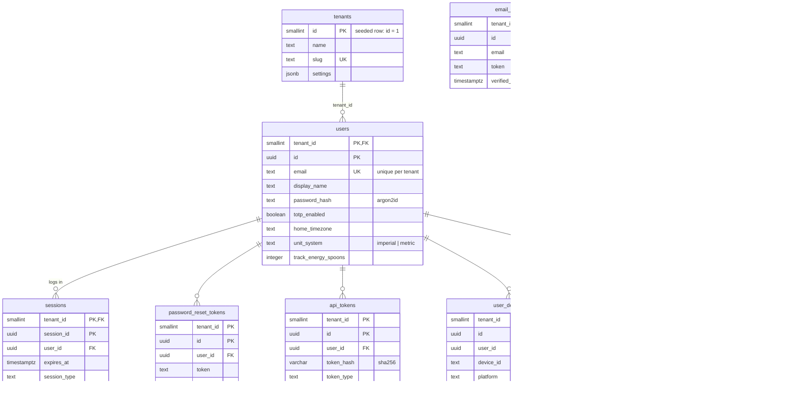

`email_verification_tokens` is deliberately unconnected: it exists before the account does. Inserting a `users` row fires the `trg_users_seed_system_folders` trigger, which creates that member's four system folders in the Documents domain.

## System & telemetry

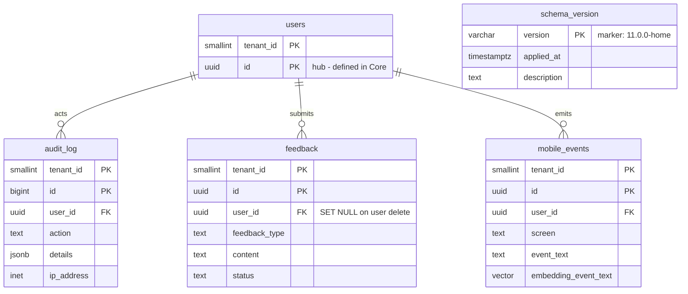

`schema_version` is global (no `tenant_id`, no FKs). `feedback.user_id` is `ON DELETE SET NULL` so feedback survives account removal — the one non-CASCADE in this domain.

## Health tracking — medications & supplements

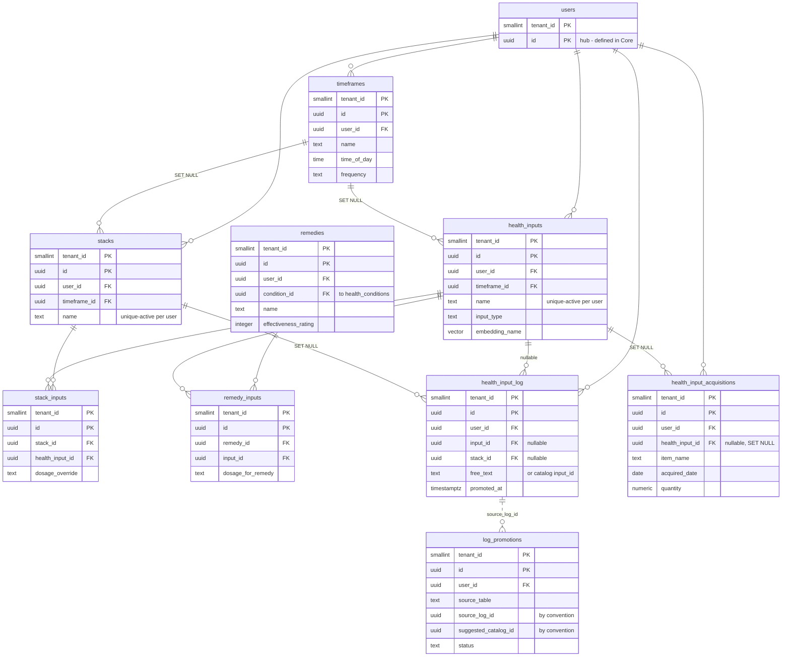

Cross-domain FKs: `remedies.condition_id` → `health_conditions` (Clinical history, SET NULL). `log_promotions` also soft-references `health_food_logv2` and `health_food_itemsv2` (Dietary & food) via `source_table` + `source_log_id` / `suggested_catalog_id` — no FK constraints, because each column spans two possible target tables. A `health_input_log` row holds either a catalog `input_id` or `free_text` (CHECK-enforced). `health_input_acquisitions` is the supply-arrival journal: a catalog-linked arrival bumps `health_inputs.current_quantity`, dose logging decrements it.

## Scheduling & reminders

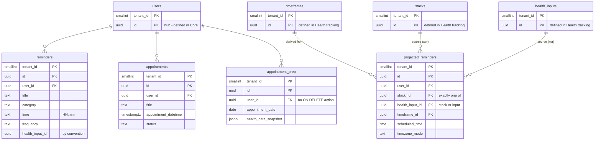

The `timeframes` / `stacks` / `health_inputs` stubs are defined in the Health tracking domain; the three `projected_reminders` FKs shown are real constraints (all CASCADE), and a CHECK enforces exactly one of `stack_id` / `health_input_id`. `reminders.health_input_id` is a bare UUID with no FK. `appointment_prep`'s FK to `users` carries no ON DELETE action (the only user FK in the schema besides `feedback` and `households` that is not CASCADE).

## Dietary, food & household

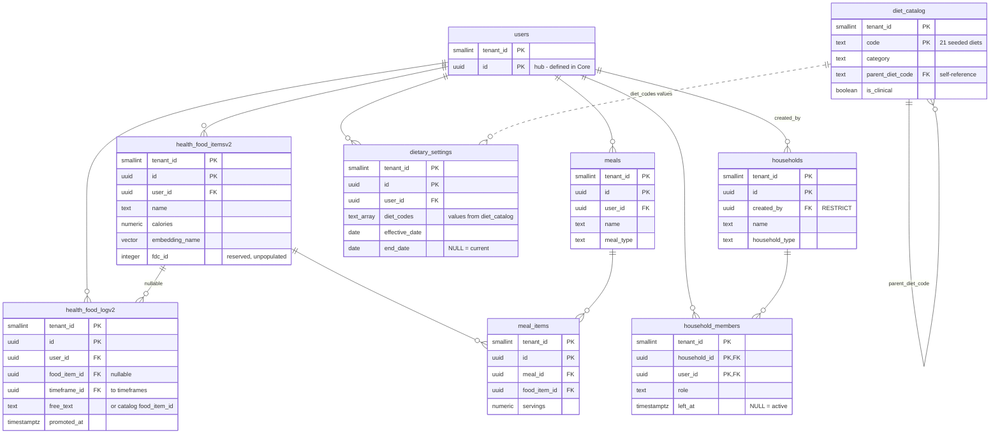

Cross-domain FK: `health_food_logv2.timeframe_id` → `timeframes` (Health tracking, SET NULL). `dietary_settings.diet_codes` values are validated against `diet_catalog.code` in the application — an array column cannot carry an FK. `diet_catalog` is seeded reference data and is the schema's one deliberate household-shared read. `households.created_by` is RESTRICT, not CASCADE.

## Vitals & metrics

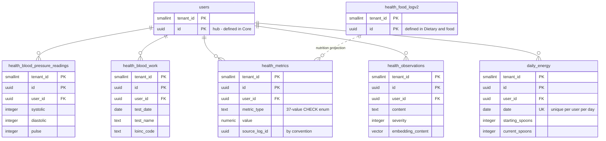

`health_metrics.source_log_id` is an FK-by-convention: the nutrition projector stamps it with the `health_food_logv2` row a projected `metric_type = 'nutrition'` metric came from, and dedupe logic branches on whether it is NULL (partial unique index for external imports, provenance lookup for projected rows).

## Clinical history

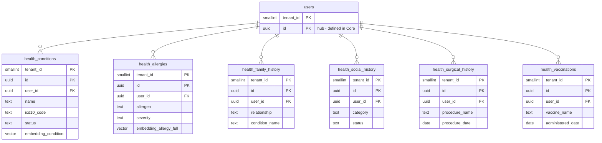

Cross-domain FK into this domain: `remedies.condition_id` → `health_conditions` (Health tracking, SET NULL). `health_allergies` is manual entry from any platform; `hkit_allergies` (HealthKit domain) is the import-side counterpart.

## Contacts

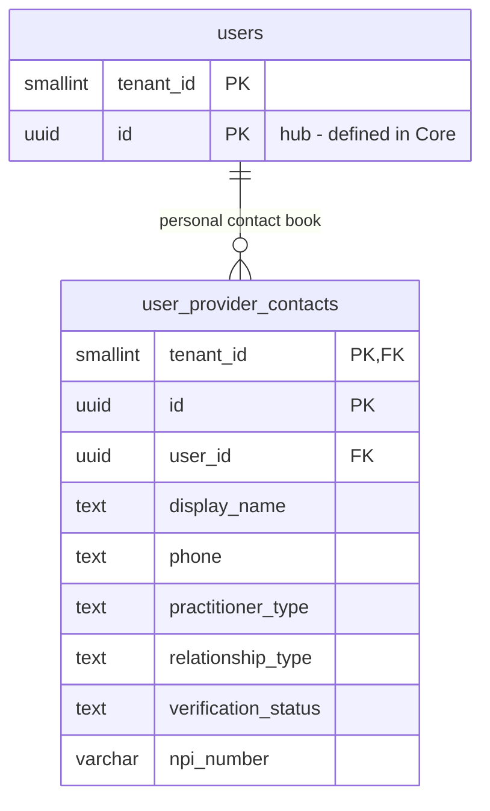

Each member's private address book of their own doctors, dentists, therapists, and other practitioners. `tenant_id` carries a direct FK to `tenants` here (one of three tables that do). The NPI columns hold optional registry-lookup results for user-entered contacts.

## Documents & embeddings

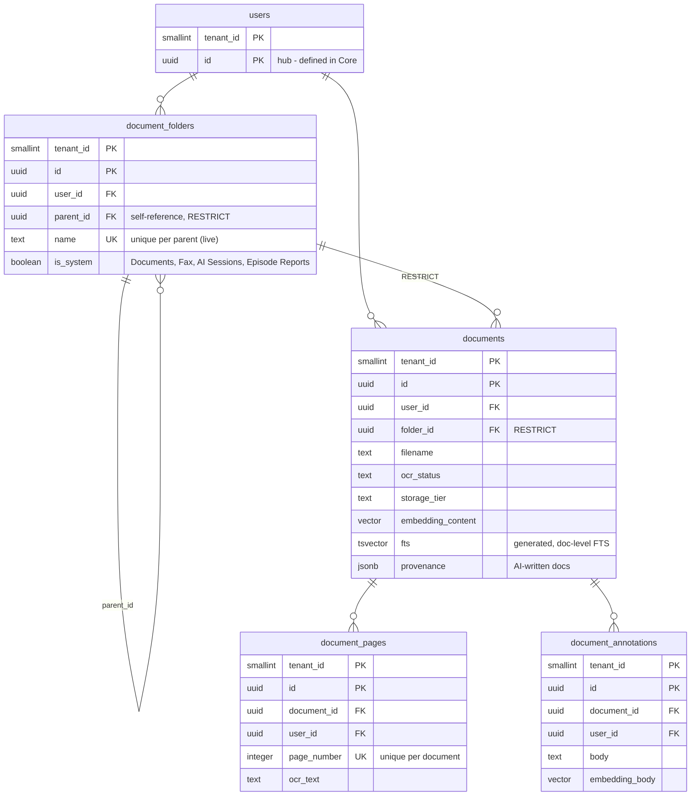

All four tables also carry the standard user FK (`document_pages` and `document_annotations` reference both their document and the owning user). The `Documents`, `Fax`, `AI Sessions`, and `Episode Reports` system folders are created per user by the `trg_users_seed_system_folders` trigger; RESTRICT on `documents.folder_id` and `document_folders.parent_id` keeps non-empty folders from being dropped.

## Garmin

```mermaid
erDiagram
    users {
        smallint tenant_id PK
        uuid id PK "hub - defined in Core"
    }
    garmin_credentials {
        smallint tenant_id PK
        uuid id PK
        uuid user_id FK, UK "1:1"
        text oauth1_token
        text email
        timestamptz last_sync
    }
    garmin_sync_jobs {
        smallint tenant_id PK
        uuid id PK
        uuid user_id FK
        text job_type
        text status
        jsonb progress
    }
    garm_daily_summ {
        smallint tenant_id PK, FK
        uuid user_id PK, FK
        date calendar_date PK
        integer total_steps
        integer resting_heart_rate
        integer total_kcals
    }
    garm_hr {
        smallint tenant_id PK, FK
        uuid user_id PK, FK
        timestamptz timestamp PK
        integer heart_rate
    }
    garm_rr {
        smallint tenant_id PK, FK
        uuid user_id PK, FK
        timestamptz timestamp PK
        numeric respiratory_rate
    }
    garm_stress {
        smallint tenant_id PK, FK
        uuid user_id PK, FK
        timestamptz timestamp PK
        integer garm_stress
    }
    garm_sleep {
        smallint tenant_id PK, FK
        uuid user_id PK, FK
        date calendar_date PK
        integer deep_sleep_secs
        integer sleep_score
    }
    garm_sleep_events {
        smallint tenant_id PK, FK
        uuid user_id PK, FK
        timestamptz start_time PK
        text sleep_type
    }
    garm_upload_date {
        smallint tenant_id PK
        uuid id PK
        uuid user_id FK
        date upload_date
        text status
    }
    data_sync_log {
        smallint tenant_id PK
        uuid id PK
        uuid user_id FK
        text source "garmin, healthkit"
        uuid job_id "by convention"
        text status "completed or failed"
        jsonb detail
    }
    users ||--o| garmin_credentials : "1:1"
    users ||--o{ garmin_sync_jobs : ""
    users ||--o{ data_sync_log : ""
    users ||--o{ garm_daily_summ : ""
    users ||--o{ garm_hr : ""
    users ||--o{ garm_rr : ""
    users ||--o{ garm_stress : ""
    users ||--o{ garm_sleep : ""
    users ||--o{ garm_sleep_events : ""
    users ||--o{ garm_upload_date : ""
```

The `garm_*` time-series tables use natural composite PKs — `(tenant_id, user_id, timestamp)` or `(tenant_id, user_id, calendar_date)` — instead of surrogate UUIDs; `user_id` is simultaneously part of the PK and of the FK to `users`. These are the highest-volume tables in the database. `data_sync_log` is the cross-ecosystem append-only sync history (Garmin and HealthKit runs), surfaced by `/all-logs` as `type='sync'`.

## HealthKit

```mermaid
erDiagram
    users {
        smallint tenant_id PK
        uuid id PK "hub - defined in Core"
    }
    hkit_record_types {
        integer id PK "global lookup, no tenant_id"
        text type_identifier UK
        text category
    }
    hkit_sources {
        smallint tenant_id PK
        integer id PK
        uuid user_id FK
        text source_name
        text source_bundle_id UK "unique per user"
    }
    hkit_records {
        smallint tenant_id PK
        bigint id PK
        uuid user_id FK
        integer record_type_id FK
        integer source_id "by convention"
        numeric value
        timestamptz start_date
    }
    hkit_activity_summaries {
        smallint tenant_id PK
        bigint id PK
        uuid user_id FK
        date date UK "unique per user"
        integer exercise_time
        integer move_time "wheelchair ring"
    }
    hkit_workouts {
        smallint tenant_id PK
        bigint id PK
        uuid user_id FK
        text workout_type
        numeric duration_seconds
    }
    hkit_user_profile {
        smallint tenant_id PK
        integer id PK
        uuid user_id FK, UK "1:1"
        date date_of_birth
        boolean wheelchair_use
    }
    hkit_clinical_records {
        smallint tenant_id PK
        integer id PK
        uuid user_id FK
        text fhir_resource_type
        text fhir_identifier UK "dedupe on re-import"
        jsonb raw_fhir
    }
    hkit_lab_observations {
        smallint tenant_id PK
        integer id PK
        uuid user_id FK
        integer clinical_record_id "by convention"
        text loinc_code
        numeric value_quantity
    }
    hkit_allergies {
        smallint tenant_id PK
        integer id PK
        uuid user_id FK
        integer clinical_record_id "by convention"
        text allergen
    }
    hkit_immunizations {
        smallint tenant_id PK
        integer id PK
        uuid user_id FK
        integer clinical_record_id "by convention"
        text vaccine_name
    }
    hkit_medications {
        smallint tenant_id PK
        integer id PK
        uuid user_id FK
        integer clinical_record_id "by convention"
        text medication_name
    }
    hkit_sync_anchors {
        smallint tenant_id PK, FK
        uuid user_id PK, FK
        text device_id PK
        text sample_type PK
        text anchor
    }
    healthkit_import_jobs {
        smallint tenant_id PK
        uuid id PK
        uuid user_id FK
        text status
        integer processed_records
    }
    hkit_record_types ||--o{ hkit_records : "record_type_id"
    hkit_sources ||..o{ hkit_records : "source_id"
    hkit_clinical_records ||..o| hkit_lab_observations : "one per parent"
    hkit_clinical_records ||..o| hkit_allergies : "one per parent"
    hkit_clinical_records ||..o| hkit_immunizations : "one per parent"
    hkit_clinical_records ||..o| hkit_medications : "one per parent"
    users ||--o{ hkit_sources : ""
    users ||--o{ hkit_records : ""
    users ||--o{ hkit_clinical_records : ""
    users ||--o| hkit_user_profile : "1:1"
    users ||--o{ healthkit_import_jobs : ""
```

`hkit_records.record_type_id` is the only real FK between HealthKit tables; `source_id` and the four `clinical_record_id` columns are by-convention pointers (dotted), each extraction table limited to one row per parent clinical record by a partial unique index. `hkit_activity_summaries`, `hkit_workouts`, `hkit_sync_anchors`, and the remaining tables all carry the standard user FK (lines omitted above for legibility). See `AppleHealthKitERD.md` for the HealthKit-specific deep dive and `HealthKitDataModel.md` / `AppleHealthKitDataModel.md` for field-level mapping.

## Mobile sync

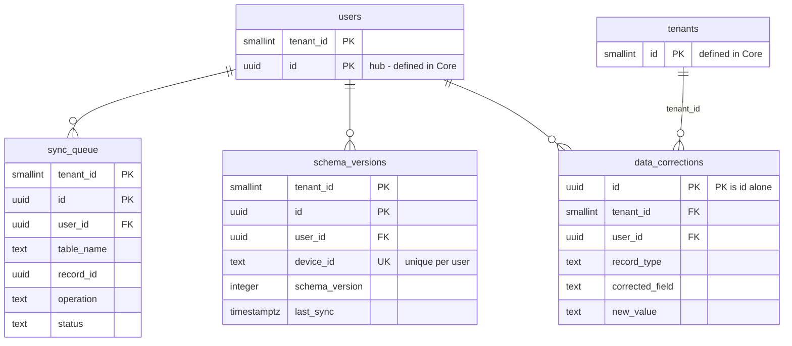

`schema_versions` (per-device, user-scoped) is distinct from the global `schema_version` marker table in System & telemetry. `data_corrections` is the only user-data table whose PK is `id` alone rather than `(tenant_id, id)`, and one of the three tables with a direct FK to `tenants`. Most user tables also carry `sqlite_id` / `synced_at` columns as the mobile-sync bookkeeping fields; `sync_queue` is the transport queue itself.
